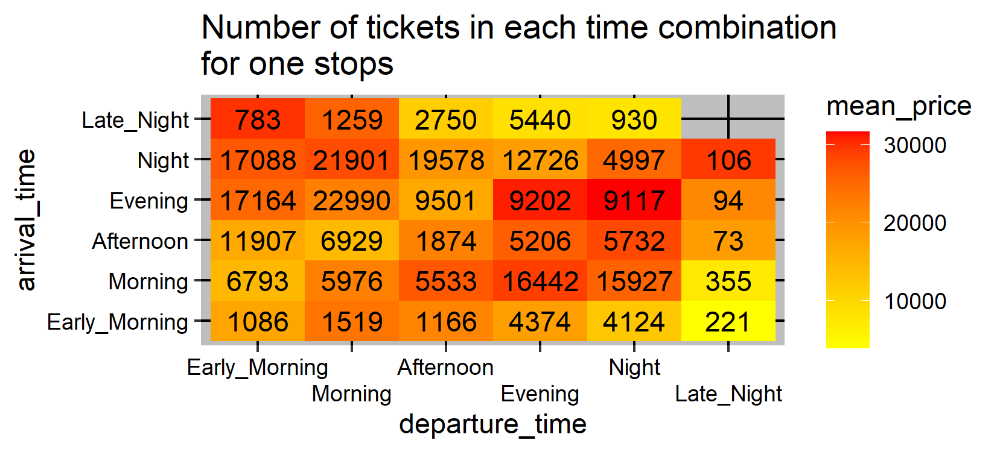

```{r setup, include=FALSE}
knitr::opts_chunk$set(echo = TRUE)

data_folder = 'data'
if(!dir.exists(data_folder)){
  dir.create(data_folder)
}
```

```{r packages, echo=FALSE, warning=FALSE, message=FALSE}
#check and download packages for the code
if(!require(tidyverse)) install.packages("tidyverse")
if(!require(caret)) install.packages("caret")

if(!require(elasticnet)) install.packages("elasticnet")
if(!require(gam)) install.packages("gam")
if(!require(randomForest)) install.packages("randomForest")

if(!require(utils)) install.packages("utils")
if(!require(DescTools)) install.packages("DescTools")
if(!require(Metrics)) install.packages("Metrics")
if(!require(doParallel)) install.packages("doParallel")
if(!require(knitr)) install.packages("knitr")

library(tidyverse)
library(caret)

library(elasticnet)
library(gam)
library(randomForest)

library(utils)
library(DescTools)
library(Metrics)

#this is for using multiple cores, depending of your computer you can avoid running the code
#of this package or change the number of cores for training the models, also I made the models
#be available to download, so you don't need to train the models
library(doParallel)
library(knitr)
```

# Introduction

This is a project for the course HarvardX PH125.9x Data Science: Capstone, for the Choose Your Own Project.
The project consist in predict the price of the ticket from different flights from India. The data was obtained form the Kaggle platform, [the database can be found here](https://www.kaggle.com/datasets/shubhambathwal/flight-price-prediction?select=Clean_Dataset.csv).

```{r database download, echo=FALSE}
#read the data
data <- read.csv(unz("./archive.zip","Clean_Dataset.csv"))

#change the type of data of each variable
data <- data %>% mutate(airline = as.factor(airline),
                        flight = as.factor(flight),
                        source_city = as.factor(source_city),
                        departure_time = as.factor(departure_time),
                        arrival_time = as.factor(arrival_time),
                        destination_city = as.factor(destination_city),
                        stops = as.factor(stops),
                        class = as.factor(class),
                        days_left = as.numeric(days_left)) %>% rename(ticketId = X)

#change the levels of the factor variables, to make plotting easier
data$stops <- factor(data$stops, levels = c("zero","one","two_or_more"))

data$departure_time <- factor(data$departure_time, 
                              levels = c("Early_Morning","Morning","Afternoon",
                                         "Evening","Night","Late_Night"))

data$arrival_time <- factor(data$arrival_time, 
                              levels = c("Early_Morning","Morning","Afternoon",
                                         "Evening","Night","Late_Night"))
```

The database has `r ncol(data)` columns, with 1 of those is an id for each ticket sold, and 1 is for the price which is our outcome, so in total we have `r ncol(data)-2` features. And has a total of `r nrow(data)` observations.

The features of the database are:

+ **airline**, which is a categorical variable with `r length(levels(data$airline))` levels. Represents the airline (company) that operates the flight. With the following airlines: `r levels(data$airline)`.
+ **flight**, which is a categorical variable with `r length(levels(data$flight))` levels. Represents the plane's flight code.
+ **source_city**, which is a categorical variable with `r length(levels(data$source_city))` levels. Represents the city which the flight takes off. Has the following cities: `r levels(data$source_city)`.
+ **departure_time**, which is a categorical variable with `r length(levels(data$departure_time))` levels. Represents the part of the day the flight departure as `r levels(data$departure_time)`.
+ **stops**, which is a categorical variable with `r length(levels(data$stops))` levels. Represents the number of stops that the flight has with the following factors: `r levels(data$stops)`.
+ **arrival_time**, which is a categorical variable with `r length(levels(data$arrival_time))` levels. Represents the part of the day the flight arrives as `r levels(data$arrival_time)`.
+ **destination_city**, which is a categorical variable with `r length(levels(data$destination_city))` levels. Represents the city where the flight will land. Has the following cities: `r levels(data$destination_city)`.
+ **class**, which is a categorical variable with `r length(levels(data$class))` levels. Represents the seat class in the flight, with the following classes: `r levels(data$class)`.
+ **duration**, which is a numerical variable, that represents the overall amount of time it takes to travel between cities in hours.
+ **days_left**, which is a numerical variable, that is calculated previously by subtracting the trip date by the booking date.

Steps made during the project:

+ Downloading the database from the platform and save it.
+ After cleaning variables of the database, in the form of factorizing features that would read as character. 
+ The next step was to analyze how a feature affects the price of the flight. 
+ After that I separated the database with a 20% for a final validation data base, and the rest for training and testing different models. 
+ Later I trained different 2 models: a gamLoess model and a random forest model, with the random forest I added a linear factor for the flight feature due the amount of levels for this feature is more than the allowed for the functions to work, so in total I have made 3 models.
+ And finally I use the validation database to calculate the predictions for the models to see how they perform.

# Analysis

All the following analysis were made using the whole database.

## Duration of the flight vs price

To analyze this variable I made different plots for each airline and group the values by class with this code:
```{r duration_vs_price_by_airline code}
  if(!file.exists(file.path(data_folder,"duration_vs_price_by_airline.png"))){
    #make the plot
    data %>% ggplot(aes(x=duration,y=price,color=class)) +
      geom_point(alpha=0.2) +
      ggtitle("Duration of flight (in hours) vs Price, per airline") +
      facet_wrap(~airline, scale="fixed") +
      guides(color = guide_legend(override.aes = list(alpha = 1,size=5)))
    
    #save the plot
    ggsave(filename = file.path(data_folder,"duration_vs_price_by_airline.png"))
  }
```


As we can see, the duration of the flight and the price, seems to be independent of each other and this can be more evident when we compare by class and airline.

## Days left vs price

For this analysis I made box plots divided by class with this code:
```{r days_left_vs_price}
  if(!file.exists(file.path(data_folder,"days_left_vs_price_by_class.png"))){
    #make the plot
    data %>% ggplot(aes(x=as.factor(days_left),y=price)) +
      geom_boxplot(aes(fill=class),outlier.alpha = 0.5,outlier.size = 0.7,width=0.5) +
      ggtitle("Days left vs Price, per class") +
      scale_x_discrete(breaks = levels(as.factor(data$days_left))[c(T, rep(F, 4))]) +
      facet_wrap(~class, scale="fixed") +
      theme(legend.position = "none") +
      xlab("days_left")
    
    #save the plot
    ggsave(filename = file.path(data_folder,"days_left_vs_price_by_class.png"))
  }
```


And I found out that both classes have higher prices when the days left are lower, and the economy class seats are cheaper than business class ones, both results as expected for airline business practices. But also I found out that the Business class seats have a bigger variance than the Economy class.

## Number of flights and mean price per route

With the following code I found the most popular flights and the mean price for each route.

```{r number flights and mean price per route}
  if(!file.exists(file.path(data_folder,"number_flights_per_route.png"))){
    #get the mean values
    mean_values <- data %>% group_by(source_city,destination_city) %>%
      summarise(mean_price = mean(price),n=n()) %>% ungroup()
    
    #setting values for not existing flights, needed for plotting
    for(city  in levels(data$source_city)){
      mean_values <- mean_values %>% add_row(source_city = city,
                                             destination_city = city,
                                             mean_price = NA,
                                             n=NA)
    }
    rm(city)
    mean_values <- as.data.frame(mean_values)
    
    #make the plot
    mean_values %>% ggplot(aes(x=source_city,y=destination_city)) +
      geom_tile(aes(fill=mean_price)) +
      geom_text(aes(x=source_city,y=destination_city,label=n)) +
      scale_fill_gradient(low = "yellow", high = "red") +
      ggtitle("Amount of tickets sold and mean price per route") +
      theme(panel.background = element_rect(fill = "white"),
            panel.grid.major = element_line(color = "gray"),
            axis.text.x = element_text(color = "black"),
            axis.text.y = element_text(color = "black"))
    
    #save the plot
    ggsave(filename = file.path(data_folder,"number_flights_per_route.png"))
    remove(mean_values)
  }
```


In this graph, the numbers are the number of tickets sold per route and the color of the tile represents the average price of the tickets sold in each route. Of course there aren't any flights that have an only city as both departure and destination.

We can see the most expensive route is from Chennai to Bangalore which is also has one of the lowest amount of flights. The cheapest city to departure and to get to is Delhi, and Mumbai is the most busy city in our list.

## Departure and arrival times vs price

In order to see the effects of the departure and arrival times I needed to group the flights by number of stops, because the number of stops affects the distribution of the departure and arrival times. This is more evident with the zero stops graph.

```{r departure and arrival time mean price for each category of stops}
 if(!file.exists(file.path(data_folder,"departure_arrival_count_mean_price_zero.png"))){
    #grouping the data so I can make different plots for each factor of stops
    mean_values <- data %>% group_by(arrival_time,departure_time,stops) %>%
      summarise(mean_price = mean(price),n=n()) %>% ungroup()
    
    #make the plots
    for(stop in unique(mean_values$stops)){
      print(mean_values %>% filter(stops == stop) %>%
              ggplot(aes(x=departure_time,y=arrival_time)) +
              geom_tile(aes(fill=mean_price)) +
              geom_text(aes(x=departure_time,y=arrival_time,label=n) ) +
              scale_fill_gradient(low = "yellow", high = "red") +
              ggtitle(paste0("Number of tickets in each time combination\nfor ",stop," stops")) +
              scale_x_discrete(guide = guide_axis(n.dodge = 2)) +
              theme(panel.background = element_rect(fill = "gray"),
                    panel.grid.major = element_line(color = "black"),
                    axis.text.x = element_text(color = "black"),
                    axis.text.y = element_text(color = "black")) )
      
      
      #save the plot
      ggsave(filename = file.path(data_folder,
                                  paste0("departure_arrival_count_mean_price_",stop,".png")),
             height = 2.5)
      Sys.sleep(2)
    }
    remove(stop,mean_values)
  }
```


The flights with zero stops have a low number of different time combinations, and we can see that the late night departure flights has the lowest amount of tickets sold and the cheapest ones for this group.

 

With one stop flights, we can see the difference with the previous plot, while the plot with zero stops only has 2 combinations for each part of the day, and the one stop plots has almost all time combinations possible. 

From this graph, we can see that:

+ The most popular time for arrival is at night.
+ These flights are on average more expensive that the ones with zero stops. (Note that the gradient are at different scale).
+ There is no relation with the number of tickets at each combination and the mean price.


From this graph we can know that the flights with 2 or more stops are the least purchased. 

It seems there isn't a relation between the price and the demand of seats in each time combination, for example, the ordering by price some flights from the most expensive to the least, we have:

1. **Early morning** departure and **evening** arrival with **1702** tickets.
2. **Evening departure** and early **morning** arrival with **252** tickets.
3. **Morning departure** and **night** arrival with **1779** tickets.
4. **Morning departure** and **evening** arrival with **1299** tickets.

## Number of stops vs price

In this section, I will compare the price of the flights and the number of stops it has grouped by the class of the ticket.

```{r Number of stops vs price}
  if(!file.exists(file.path(data_folder,"number_stops_vs_price_by_class.png"))){
    #make the plot
    data %>% ggplot(aes(x=stops,y=price)) +
      geom_boxplot(aes(fill=class),outlier.alpha = 0.5,outlier.size = 0.7) +
      ggtitle("Number of stops vs price, by class")
    
    #save the plot
    ggsave(filename = file.path(data_folder,"number_stops_vs_price_by_class.png"))
  }
```


In this plot, we can see that the economy class flights most of the time are far cheaper than the business class ones, with a few exceptions where it's cheaper to buy a business class flight, this is probably an effect of the days left for said flight. 

But also there is a general increase in prices with the more stops a flight has, this is more noticeably with the business class.

## Quantity of tickets by flight

One analysis left is the amount of tickets for each plane's flight code. Of course making a plot with `r length(levels(data$flight))` unique flight codes, would make the x axis impossible to read, so I sacrificed some aesthetic to get a better analysis.

```{r amount of tickets by flight}
#quantity of tickets by flight
{
  if(!file.exists(file.path(data_folder,"number_of_tickets_by_flight.png"))){
    #reorder the data and make the plot
    data %>% count(flight) %>% arrange(desc(n)) %>%
      ggplot(aes(x = reorder(flight, -n), y=n)) +
      geom_col() +
      theme(axis.text.x = element_blank(),
            axis.ticks.x = element_blank()) +
      xlab("flight") +
      ggtitle("Number of tickets sold by flight")
    
    #save the plot
    ggsave(filename = file.path(data_folder,"number_of_tickets_by_flight.png"))
  }
}
```


We can see that the distribution follows some form of exponential function. So we get that analyzing a few amount of flights, I would analyze a big amount of the tickets and therefore a big amount of the data. But how many flights I need to consider? 

Well this question it is answered by considering the random forest model in the train function of the caret library only allows a maximum of 53 factors for a predictor, so I need 52 levels for flights and one left for grouping the rest of the flights in a "other" category.

With this code, I get the top 52 of the most popular flights:
```{r top flights}
top_flights <- data %>% select(flight) %>% group_by(flight) %>% count() %>% 
  arrange(desc(n)) %>% head(52)
```
The top 10 flights are:
```{r table top flights, echo=FALSE}
knitr::kable(top_flights %>% head(10))
```

And to know the proportion of the total tickets in the 52 top flights, I need this code:
```{r percentage top flights}
#to know how many of the tickets are in the top 52 flights
mean(data$flight %in% top_flights$flight)
```

So we know that with the top 52 flights, we get approximately `r round(mean(data$flight %in% top_flights$flight),2)*100`% of the total tickets sold. I made the decision of not using this predictor in this projects, because with the limited hardware that I have the time it would take to the caret functions to end the training doesn't outweigh the benefits of making a better model. 

# Methods

Because I created different models I decided to make a validation database, that consists of 20% of all the data.

```{r validation database}
####Data split for a final validation####
set.seed(20220622, sample.kind="Rounding")
test_index <- createDataPartition(y=data$price,times = 1, p=0.2, list=FALSE)

flight_tickets <- data[-test_index,]
temp <- data[test_index,]

#make sure that flight in validation set are also in the flight_tickets set
validation <- temp %>%
  semi_join(flight_tickets, by = "flight") %>%
  semi_join(flight_tickets, by = "duration")

#add rows removed from validation set back into flight_tickets set
removed <- anti_join(temp, validation)
flight_tickets <- rbind(flight_tickets, removed)

rm(test_index,removed,temp)

remove(data)
```

And with an additional split of the remaining data, that consist in 20% for testing and 80% for training. I decided these values because I wanted to have less data for training in order to save some computational power but at the same time not compromising the precision of the model.

```{r data split for training and testing}
##split for training for training and testing
set.seed(20220627, sample.kind="Rounding")
test_index <- createDataPartition(y=flight_tickets$price,times = 1, p=0.2, list=FALSE)

flight_tickets <- flight_tickets %>%
  mutate(duration = round(duration))

temp <- flight_tickets[test_index,]
flight_train <- flight_tickets[-test_index,]

#make sure that flight in test set are also in the train set
flight_test <- temp %>%
  semi_join(flight_train, by = "flight") %>%
  semi_join(flight_train, by = "duration")

#add rows removed from test set back into train set
removed <- anti_join(temp, flight_test)
flight_train <- rbind(flight_train,removed)

remove(test_index,temp,removed)
```

I put the semi join by flight and duration because I get some errors while training the models if I didn't check that this values weren't available in the training data while they were in the test data.

## Generalized Additive Model using LOESS model

I decided to use this model because it was in the textbook of this course, and I wanted to see how it would perform in a regression model.

```{r gamLoess model,tidy=TRUE, tidy.opts=list(width.cutoff=60)}
####gamLoess model####
if(!file.exists(file.path(data_folder,"gamLoess.Rdata"))){
  #setting the parameters to search
  set.seed(1, sample.kind="Rounding")
  gamLoess_parameters <- expand.grid(span=seq(0.10,1,len=25), degree=1)
  
  #starting the multi-processing code
  cl <- makeCluster(4)
  registerDoParallel(cl)
  
  train_gamLoess <- train(price~.-ticketId-flight,method="gamLoess",data=flight_train,
                          tuneGrid = gamLoess_parameters,
                          trControl = trainControl(allowParallel = T))
  
  #ending the multi-processing code
  stopCluster(cl)
  
  #get results of the model
  predictions_gamLoess <- predict(train_gamLoess, flight_test)
  results_gamLoess <- postResample(predictions_gamLoess, flight_test$price)
  results_gamLoess
  
  #save the model
  save(train_gamLoess,predictions_gamLoess,results_gamLoess, file=file.path(data_folder,"gamLoess.RData"))
} else {
  load(file = file.path(data_folder,"gamLoess.Rdata"))
}
```

From this model we get a RMSE of `r round(results_gamLoess[1],2)`, and a R squared value of `r round(results_gamLoess[2],2)` which is a good value, but we get `r sum(predictions_gamLoess<0)` negative predictions, which of course is a very important sign that there is a lot of room for improvement.

## Random forest model

This model has multiple parameters to tune, to decide what value to choose I decided for the ones that has the lowest RMSE value.
The first one is mtry, which I tuned using the following code:

```{r rf tune mtry}
####random forest model####
if(!file.exists(file.path(data_folder,"tune_rf.Rdata"))){
  set.seed(1, sample.kind="Rounding")
  
  #for searching for the best mtry value
  tune_rf <- tuneRF(flight_train[,-c(1,3,12)], flight_train[,12],
                    ntreeTry = 50, stepFactor = 1.5)
  
  #get the best mtry value
  mtry_best <- tune_rf[which.min(tune_rf[,2]),1]
  save(tune_rf,mtry_best, file=file.path(data_folder,"tune_rf.RData"))
}else{
  load(file = file.path(data_folder,"tune_rf.RData"))
}
```

In the end I get the best value for mtry is `r mtry_best`.

The next parameter to tune is node size, because it's a heavy task, I had to use a fraction of the testing data, the best proportion I found was 20%.

```{r rf tune node size, eval=FALSE}
#for searching the best node size
nodesize <- seq(5,25,5)
set.seed(1, sample.kind="Rounding")

#due to hardware capability, I use 20% of the data
sample_train <- flight_train %>% sample_frac(0.20)

rf_rmses <- sapply(nodesize, function(ns){
  #starting the multi-processing code
  cl <- makeCluster(2)
  registerDoParallel(cl)
  
  rmse_rf <- train(price~.-ticketId-flight, method = "rf" ,data = sample_train,
                   tuneGrid = data.frame(mtry = mtry_best),
                   trControl = trainControl(allowParallel = T),
                   nodesize = ns,
                   ntree = 100)$results$RMSE
  
  #ending the multi-processing code
  stopCluster(cl)
  
  print(rmse_rf)
  return(rmse_rf)
})

#save the tuning values for the model
save(tune_rf,mtry_best,sample_train,nodesize,rf_rmses,
     file=file.path(data_folder,"tune_rf.RData"))
```

In the following plot we can see the effect of the node size in this model.

```{r qplot nodesize}
qplot(nodesize, rf_rmses)
```

The best value of node size is `r nodesize[which.min(rf_rmses)]`, which has a RMSE value of `r round(rf_rmses[which.min(rf_rmses)],2)`.

So to get the final model I use the following code, that contains the values previously tuned.

```{r rf final model}
###final model for rf
if(!file.exists(file.path(data_folder,"rf.RData"))){
  #load the best values
  load(file = file.path(data_folder,"tune_rf.RData"))
  
  #final model
  set.seed(1, sample.kind="Rounding")
  train_rf <- randomForest(price ~.-ticketId-flight, data=flight_train,ntree = 100, 
                           mtry= mtry_best,
                           nodesize = nodesize[which.min(rf_rmses)])
  
  
  #get results of the model
  predictions_rf <- predict(train_rf, flight_test)
  results_rf <- postResample(predictions_rf, flight_test$price)
  results_rf
  
  #save the model
  save(train_rf,predictions_rf,results_rf, file=file.path(data_folder,"rf.RData"))
}else{
  load(file = file.path(data_folder,"rf.RData"))
}
```

In the end the model has a RMSE value of `r round(results_rf[1],2)` and a R squared value of `r round(results_rf[2],4)` and I get a total of `r sum(predictions_rf < 0)` negative predictions. Which is a great improvement from the previous model.

### Random forest with a linear flight-effect model

Using a similar method used for the movie recommendation model in the textbook of this course. I predicted the price of the ticket using the random forest model, and then using the difference between the real value and the prediction was used for calculating a effect for each flight code.

```{r rf with flight effect}
###adding a linear flight effect to the rf model###
if(!file.exists(file.path(data_folder,"flight_effect.RData"))){
  
  #get predicted values of price for train and test data
  price_prediction <- list()
  
  #values of price for train set with ticketId
  price_prediction$train <- data.frame(flight_train$ticketId,predict(train_rf, flight_train))
  colnames(price_prediction$train) <- c("ticketId","price_prediction")
  #values of price for test set with ticketId
  price_prediction$test <- data.frame(flight_test$ticketId,predict(train_rf, flight_test))
  colnames(price_prediction$test) <- c("ticketId","price_prediction")
  
  #search and get the best value of lambda for regularization
  lambdas <- seq(0,5,0.5)
  rmses_reg_flight <- sapply(lambdas, function(lambda){
    flight_effect <- flight_train %>%
      left_join(price_prediction$train, by="ticketId") %>%
      group_by(flight) %>%
      summarise(flight_effect = sum(price - price_prediction)/(n() + lambda))
  
    predicted <- flight_test %>%
      left_join(price_prediction$test, by="ticketId") %>%
      left_join(flight_effect, by="flight") %>%
      mutate(pred = price_prediction + flight_effect) %>%
      pull(pred)
    
    return(RMSE(flight_test$price, predicted))
  })
  
  best_lambda <- lambdas[which.min(rmses_reg_flight)]
  
  #get values of effects
  flight_effect <- flight_train %>%
    left_join(price_prediction$train, by="ticketId") %>%
    group_by(flight) %>%
    summarise(flight_effect = sum(price - price_prediction)/(n() + best_lambda))
  
  #get price prediction
  predictions_rf_flight_ef <- flight_test %>%
    left_join(price_prediction$test, by="ticketId") %>%
    left_join(flight_effect, by="flight") %>%
    mutate(pred = price_prediction + flight_effect) %>%
    pull(pred)
  
  #get results of the model
  results_rf_flight_ef <- postResample(predictions_rf_flight_ef, flight_test$price)
  results_rf_flight_ef
  
  #remove unnecessary predictions
  remove(predictions_gamLoess,predictions_rf,predictions_rf_flight_ef)
  
  #save the model
  save(flight_effect, results_rf_flight_ef, file = file.path(data_folder,"flight_effect.RData"))
}else{
  load(file = file.path(data_folder,"flight_effect.RData"))
}
```

This approach has a RMSE value of `r round(results_rf_flight_ef[1],2)` and a R squared value of `r round(results_rf_flight_ef[2],4)`, which is better than just using the random forest model. But it's most likely that using the flight code predictor in the train functions would be a lot better than using this approach.

# Results

Now I will use the validation set to get the final results for these models.

```{r results table}
####Validation set####
#save the actual value and predictions, for easy use
predictions_validation <- list()
predictions_validation$actual_price <- validation$price

#gamLoess model
#get predictions for this model
predictions_validation$gamLoess <- predict(train_gamLoess,validation)

#put results in table 
validation_results <- 
  tibble(model="gamLoess", 
         RMSE = RMSE(predictions_validation$actual_price,predictions_validation$gamLoess),
         negative_predictions = sum(predictions_validation$gamLoess<0),
         min = quantile(predictions_validation$gamLoess, names = F)[1],
         lower_quartile = quantile(predictions_validation$gamLoess, names = F)[2],
         median = quantile(predictions_validation$gamLoess, names = F)[3],
         upper_quartile = quantile(predictions_validation$gamLoess, names = F)[4],
         max = quantile(predictions_validation$gamLoess, names = F)[5])

#rf model
#get predictions for this model
predictions_validation$rf <- predict(train_rf,validation)

#put results in table 
validation_results <- validation_results %>%
  add_row(model="rf",
          RMSE=RMSE(predictions_validation$actual_price,predictions_validation$rf),
          negative_predictions =  sum(predictions_validation$rf<0),
          min = quantile(predictions_validation$rf, names = F)[1],
          lower_quartile = quantile(predictions_validation$rf, names = F)[2],
          median = quantile(predictions_validation$rf, names = F)[3],
          upper_quartile = quantile(predictions_validation$rf, names = F)[4],
          max = quantile(predictions_validation$rf, names = F)[5])

#rf model with linear flight effect
#get predictions for this model
#save data frame with ticketId and prediction for later use
validation_price_pred <- data.frame(validation$ticketId,predictions_validation$rf)
colnames(validation_price_pred) <- c("ticketId","price_prediction")

predictions_validation$rf_flight_ef <- validation %>%
  left_join(validation_price_pred, by="ticketId") %>%
  left_join(flight_effect, by= "flight") %>%
  mutate(pred = price_prediction + flight_effect) %>%
  pull(pred)

remove(validation_price_pred)

#put results in table 
validation_results <- validation_results %>%
  add_row(model="rf+flight effect",
          RMSE=RMSE(predictions_validation$actual_price,predictions_validation$rf_flight_ef),
          negative_predictions = sum(predictions_validation$rf_flight_ef<0),
          min = quantile(predictions_validation$rf_flight_ef, names = F)[1],
          lower_quartile = quantile(predictions_validation$rf_flight_ef, names = F)[2],
          median = quantile(predictions_validation$rf_flight_ef, names = F)[3],
          upper_quartile = quantile(predictions_validation$rf_flight_ef, names = F)[4],
          max = quantile(predictions_validation$rf_flight_ef, names = F)[5])

knitr::kable(validation_results, digits = 0)
```

In this table I use multiple criteria to choose the model that I would recommend to use, but the principal criteria is the existence of negative value predictions, that means that I recommend the random forest model because it doesn't predict negative prices.

Also the quantiles for both random forest models are close enough that I wouldn't use them for considering which model is better, but of course the biggest different the minimum price prediction is still important, because that differences could be explain with the randomness of the data.

So in conclusion I recommend to use the second model, the random forest model.

# Conclusion

In this report I created 3 models to predict the prices of flights of different airlines, in this case the best results I could get was using a random forest model.

From this report we get that the random forest model is useful for predicting the price of a ticket. Which can be useful for small business, since with this model is easy to predict different results if the categories are well defined, for example: in a bakery the price would be the outcome, and the predictors could be the product sold like bread or cake, the flavor, the ingredients, and with this and/or more predictors a price for a new product could be easily be predicted.

I get some good results, but there is a lot of room for improvement, these issues I divided in different categories:

+ More and better hardware, since I'm doing this project in a laptop, the training of the models took too much time, and I couldn't use the flight predictor in the caret functions, which affected the results of my predictions. In this area, I found two principal issues.
  * I couldn't use the full database in the caret functions which most likely would create a better model.
  * I couldn't explore more models to find a better result.
+ Data available, the predictors available in the kaggle database are good for the project, but there are other factors that affects the price of a flight, for example:
  * Fuel prices.
  * How many seats are available when buying a ticket.
  * Which part of the year did the client buy the ticket, and when the flight will take off.
  * And more recently the COVID-19 pandemic and government regulations on flights.
  
For future work I have the following plans:

+ Use dummy variables for the predictors with a lot of categories.
+ Find different models, especially variations of the random forest model.
+ Since the database is frequently updated, I could get more data and merge it with the database that I already have or used it to test the models.
